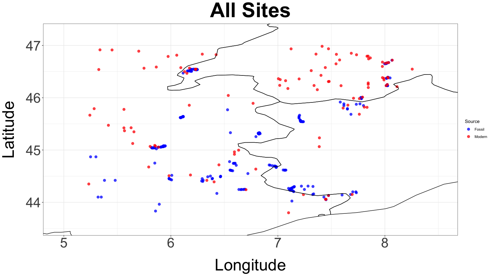
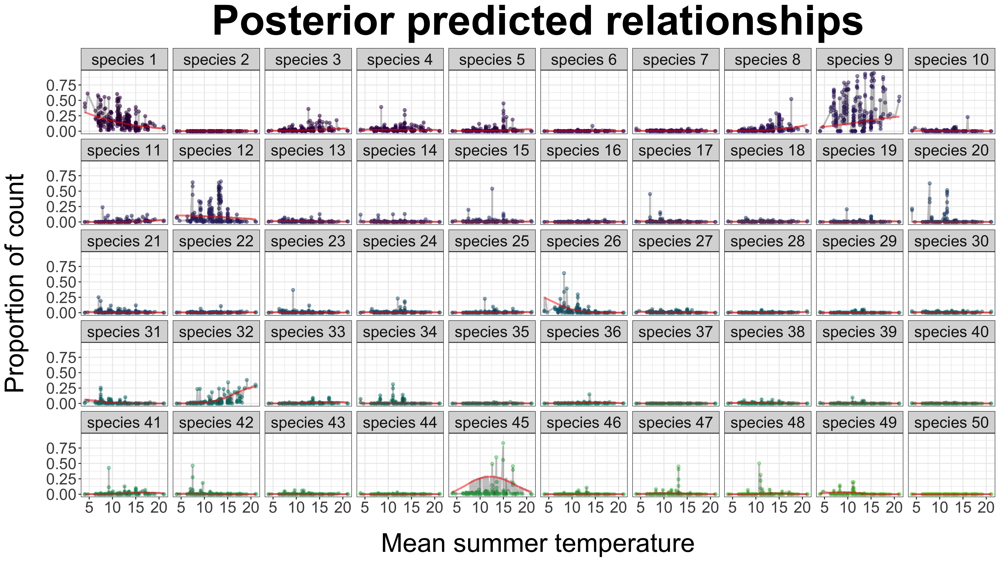
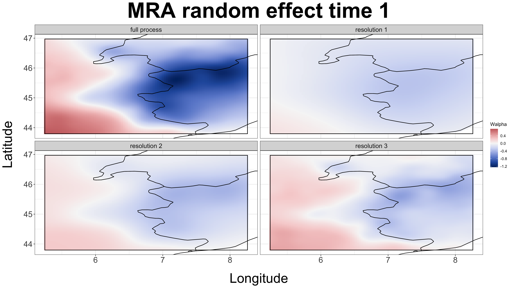
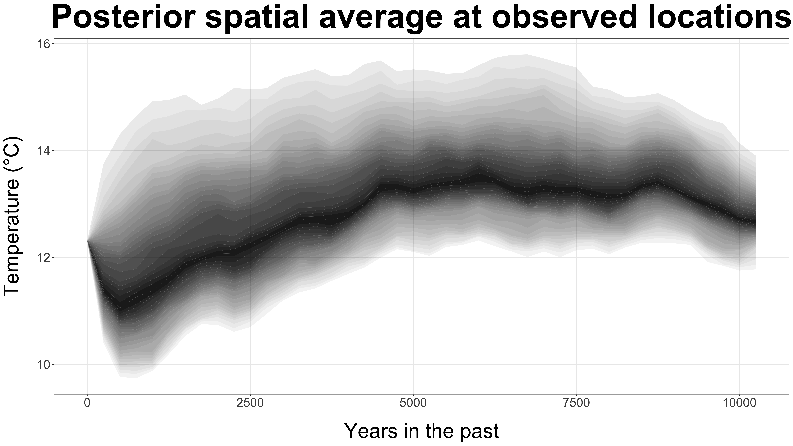
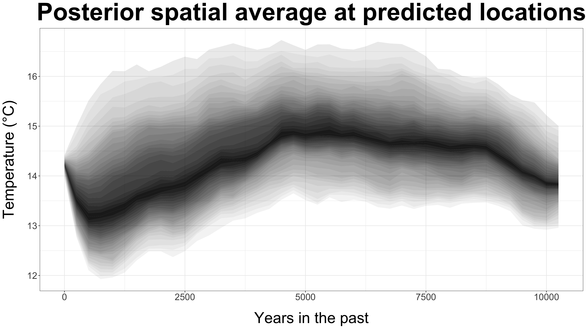
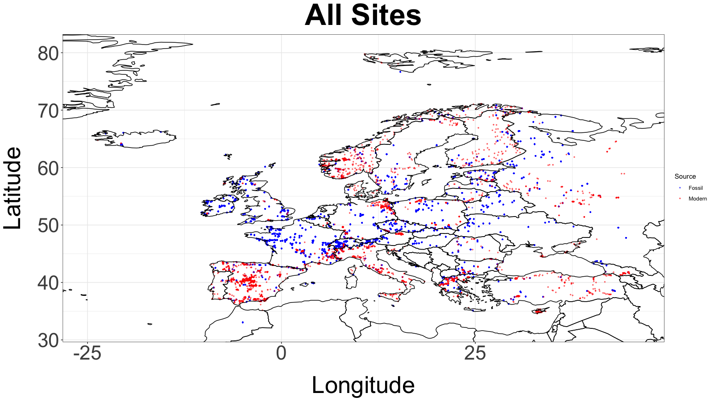

  
\newcommand{\bs}[1]{\boldsymbol{#1}}
\newcommand{\bm}[1]{\mathbf{#1}}
\newcommand{\oN}[1]{\operatorname{#1}}

<!-- To stop inf_mr, use:
servr::daemon_stop(1)
 -->
 
```{r setup, include=FALSE}
knitr::opts_chunk$set(echo = FALSE)
library(tidyverse)
library(knitr)
library(pgR)
```

<!-- ## Pollen is widely available across the globe -->

<!-- <center> -->
<!-- <video width="600" height="480" muted controls> -->
<!--   <source src="./pollen.mp4" type="video/mp4"> -->
<!-- </video> -->
<!-- </center> -->


## Pollen is a unique paleoclimate proxy

- Globally distributed.

<hr style="height:18px; visibility:hidden;" />

- Trees are long-lived -- little evolutionary drift during the Holocene.

<hr style="height:18px; visibility:hidden;" />

- Current species distributions with respect to climate are well understood.

<hr style="height:18px; visibility:hidden;" />

- Many databases of pollen data.
    - [Neotoma](https://www.neotomadb.org/groups/category/pollen).
    - [European Pollen Database](http://www.europeanpollendatabase.net/index.php).
    - [Global Pollen Database](https://ecologicaldata.org/wiki/global-pollen-database).
    - [NOAA Pollen Database](https://www.ncdc.noaa.gov/data-access/paleoclimatology-data/datasets/pollen).


<!-- ## Some like it hot, some not -->

<!-- ```{r, out.width = "100%", fig.align = 'center', cache = TRUE, message = FALSE} -->
<!-- library(cowplot) -->
<!-- p1 <- ggdraw() + draw_image(magick::image_read_pdf("psemen.pdf"), scale = 0.9) -->
<!-- p2 <- ggdraw() + draw_image(magick::image_read_pdf("quefal.pdf"), scale = 0.9) -->

<!-- plot_grid(p1, p2) -->
<!-- # knitr::include_graphics(c("psemen.pdf", "quefal.pdf")) -->
<!-- ``` -->


<!-- - <font size="3"> -->
<!-- Source: [https://www.fs.fed.us/database/feis/pdfs/Little/aa_SupportingFiles/LittleMaps.html](https://www.fs.fed.us/database/feis/pdfs/Little/aa_SupportingFiles/LittleMaps.html) -->
<!-- </font> -->


## Most analysis are inherently non-spatial

- Due to challenging data likelihood.

<hr style="height:24px; visibility:hidden;" />

- Extremely noisy relationship between data and process.

    <hr style="height:12px; visibility:hidden;" />

    - No obvious patterns when plotting the data.
    
    <hr style="height:12px; visibility:hidden;" />

    - Inverse prediction problem.

<hr style="height:24px; visibility:hidden;" />

- Lack of good statistical software.    

    <hr style="height:12px; visibility:hidden;" />
    
    - gitHub package [pollenReconstruction](https://jtipton25.github.io/pollenReconstruction/) in development. 
    


## Modeling goal

- Link the observed pollen counts to climate states during the modern period.

<hr style="height:24px; visibility:hidden;" />

- Use the learned relationship to predict unobserved climate state.

<hr style="height:24px; visibility:hidden;" />

- Generate climate histories that are local to the site of interest with uncertainty.

<hr style="height:180px; visibility:hidden;" />


<div class="footer" style="font-size:80%;"> @tipton2019predicting </div>

## Setting the stage 

- Spatially explicit reconstructions of climate variables is important.

    <hr style="height:12px; visibility:hidden;" />

    - Many important ecological questions are local.
    
    <hr style="height:12px; visibility:hidden;" />

    - Predictions at all locations remove the effects of sampling bias in paleoclimate reconstruction.


<hr style="height:24px; visibility:hidden;" />

- Prior work -- 4 sites and total compute time of approximately 28 hours.

    <hr style="height:12px; visibility:hidden;" />

    - Currently: 363 sites with total compute time less than 2 hours.


<hr style="height:24px; visibility:hidden;" />

<div class="footer" style="font-size:80%;"> @holmstrom2015bayesian </div>


---

```{r, fig.align='center', out.width = '100%'}
 
```

## Data model 


* Sediment samples from a lake.

<hr style="height:18px; visibility:hidden;" />

* Take 1cm$^3$ cubes along the length of the sediment core.

<hr style="height:18px; visibility:hidden;" />

* In each cube, researcher counts the first $M$ pollen grains and identifies to species/OTU.

<hr style="height:18px; visibility:hidden;" />

* Raw data are counts of each species.

<hr style="height:18px; visibility:hidden;" />

- Compositional count data.

## Data model

$$\begin{align*}
\mathbf{y}(\mathbf{s}, t) & \sim \oN{Multinomial}(M(\mathbf{s}, t), \pi_{SB}(\boldsymbol{\eta}(\mathbf{s}, t))) 
\end{align*}$$

<hr style="height:24px; visibility:hidden;" />

- $\mathbf{y}(\mathbf{s}, t)$ is a $J$ dimensional vector of counts at site $\bm{s} \in \mathcal{D}$ and time $t \in \{1, \ldots, n_t\}$

<hr style="height:24px; visibility:hidden;" />

- $M(\mathbf{s}, t) = \sum_{j=1}^J \mathbf{y}_j(\mathbf{s}, t)$ is the total count observed.

<hr style="height:24px; visibility:hidden;" />

- Link the underlying climate states to the probability of observing species $j$ through the latent variable $\eta_j(\bm{s}, t)$
    
## Data model

- $\pi_{SB}(\boldsymbol{\eta}(\mathbf{s}, t))$ is a stick breaking transformation.

    <hr style="height:12px; visibility:hidden;" />
    
    - The map $\pi_{SB}: \mathcal{R}^{J-1} \rightarrow \Delta^{J}$ transforms the $J-1$ dimensional vector $\boldsymbol{\eta}(\mathbf{s}, t)$ to the $J$ dimensional unit simpled $\mathcal{\Delta}^{J}$.
    
<hr style="height:24px; visibility:hidden;" />

- Other maps to the unit simplex could be used (i.e., multi-logit), but the stick-breaking map will be important later.

<hr style="height:24px; visibility:hidden;" />


## Data model (ignoring spatio-temporal indexing)

$$\begin{align*}
[\bm{y} | M, \pi_{SB}(\boldsymbol{\eta})] & =\oN{Multinomial}(\bm{y} | M, \pi_{SB}(\boldsymbol{\eta})) \\
& = \prod_{j=1}^{J-1} \oN{binomial}(y_j | M_j, \tilde{\pi}_j) \\
& = \prod_{j=}^{J-1} {M_j \choose y_j} \frac{(e^{\eta_j})^{y_j}}{(1 + e^{\eta_j})^{M_j} }
\end{align*}$$

- $M_j = M - \sum_{k < j} M_k$.

<hr style="height:24px; visibility:hidden;" />
    
- Define the partial probabilities $\tilde{\pi}_j = \pi_{SB}(\boldsymbol{\eta})_j$ using the stick-breaking representation.

<hr style="height:8px; visibility:hidden;" />

<div class="footer" style="font-size:80%;"> @polson2013bayesian, @linderman2015dependent </div>


## Data model (ignoring spatio-temporal indexing)

$$\begin{align*}
\frac{(e^{\eta_j})^{y_j}}{(1 + e^{\eta_j})^{M_j} } & = 2^{-M_j} e^{\kappa(y_j) \eta_j} \int_0^\infty e^{- \omega_j \eta_j^2 / 2 } [\omega_j | M_j, 0] \,d \omega
\end{align*}$$

<hr style="height:24px; visibility:hidden;" />

- The integral identity is proportional to the product representation of the multinomial distribution

<hr style="height:24px; visibility:hidden;" />

- The density $[\omega_j | M_j, 0]$ is a P&oacute;lya-gamma distribution $PG(b, c)$

<hr style="height:96px; visibility:hidden;" />

<div class="footer" style="font-size:80%;"> @polson2013bayesian, @linderman2015dependent </div>

## Data model (ignoring spatio-temporal indexing)

- With a prior $[\eta_j]$, joint density $[y_j, \eta_j]$ is 

<hr style="height:24px; visibility:hidden;" />

$$\begin{align*}
[\eta_j, y_j] & =  [\eta_j] {M_j \choose y_j} \frac{(e^{\eta_j})^{y_j}}{(1 + e^{\eta_j})^{M_j} }\\
& = \int_0^\infty   [\eta_j] {M_j \choose y_j} 2^{-M_j} e^{\kappa(y_j) \eta_j} e^{- \omega_j \eta_j^2 / 2 } [\omega_j | M_j, 0] \,d \omega
\end{align*}$$

<hr style="height:24px; visibility:hidden;" />

where the integral defines a joint density over $[\eta_j, y_j, \omega_j]$.

<hr style="height:24px; visibility:hidden;" />

<div class="footer" style="font-size:80%;"> @polson2013bayesian, @linderman2015dependent </div>
## Data model

- Using this integral representation, we have

    $$\begin{align*}
    \omega_j | \eta_j, y_j & \sim \oN{PG( M_j, \eta_j)}
    \end{align*}$$
    
    which can be sampled using the exponential tilting property of the P&oacute;lya-gamma distribution 

<hr style="height:24px; visibility:hidden;" />

- If $[\eta_j]$ is Gaussian, then $[\eta_j | \omega_j, y_j]$ is also Gaussian which enables conjugate sampling.

## Data model

- There is a cost:

    <hr style="height:12px; visibility:hidden;" />
    
    - Requires sampling the $\omega_j$s and these are computationally expensive.
    
    <hr style="height:12px; visibility:hidden;" />
    
    - However, these are also embarrassingly parallel.
    
    <hr style="height:12px; visibility:hidden;" />
    
    - Efficiently sampled using openMP parallelization.

<hr style="height:24px; visibility:hidden;" />
- For all examples tested so far with reduced-rank spatial processes, sampling P&oacute;lya-gamma random variables is the limiting computational cost.


<!--     ```{r} -->
<!--     J <- 4 -->
<!--     eta <- matrix(rnorm(5 * (J-1)), 5, J-1) -->
<!--     eta_to_pi(eta) -->
<!--     ``` -->

## Process model -- functional relationship
 

$$\begin{align*}
\eta_j(\bm{s}, t) = \color{blue}{\beta_{0j}} + \color{blue}{\beta_{1j}} \left( \bm{x}'(\bm{s}, t) \bs{\gamma} + \bm{w}'(\bm{s}) \bs{\alpha}(t) \right) + \color{blue}{\varepsilon(\bm{s}, t)}
\end{align*}$$

<hr style="height:24px; visibility:hidden;" />

- $\color{blue}{\beta_{0j}}$ and $\color{blue}{\beta_{1j}}$ are regression coefficients with respect to the climate state $\bm{Z}(\bm{s}, t) = \left( \bm{x}'(\bm{s}, t) \bs{\gamma} + \bm{w}'(\bm{s}) \bs{\alpha}(t) \right)$.

<hr style="height:24px; visibility:hidden;" />

- $\color{blue}{\varepsilon(\bm{s}, t)} \stackrel{iid}{\sim} \oN{N}(0, \sigma^2_j)$ models overdispersion relative to the linear regression response.


---

```{r, fig.align='center', out.width = '100%'}

```

## Process model -- climate process 

$$\begin{align*}
\eta_j(\bm{s}, t) = \beta_{0j} + \beta_{1j} \left( \color{red}{\bm{x}'(\bm{s}, t) \bs{\gamma}} + \color{purple}{\bm{w}'(\bm{s}) \bs{\alpha}(t)} \right) + \varepsilon(\bm{s}, t)
\end{align*}$$

$\color{red}{\bm{X}(t) = \begin{pmatrix} \bm{x}'(\bm{s}_1, t) \\ \vdots \\ \bm{x}'(\bm{s}_n, t) \end{pmatrix}}$ are fixed covariates (elevation, latitude, etc.).

- We assume $\color{red}{\mathbf{X}(t) \equiv \mathbf{X}}$ for all $t$ although temporally varying covariates are possible (volcanic forcings, Milankovitch cycles, etc.).

- $\color{purple}{\bm{W} = \begin{pmatrix} \bm{w}'(\bm{s}_1) \\ \vdots \\ \bm{w}'(\bm{s}_n) \end{pmatrix}}$ are spatial basis functions with temporal random effects $\color{purple}{\boldsymbol{\alpha}(t)}$.

- $\mathbf{Z}_0 \sim \oN{N} (\color{red}{\bm{X}'(1) \bs{\gamma}} + \color{purple}{\bm{W} \bs{\alpha}(1)}, \sigma^2_0 \bm{I})$ is the observed modern climate state.

---

```{r, fig.align='center', out.width = '100%'}
knitr::include_graphics("./images/estimated-fixed-effects-fixed-mu.png") 
```

## Process model -- $\color{purple}{\mbox{random effects}}$  

- Challenge: scaling to 1000s of sites and 15,000 years ($\approx 60$ time increments)

<hr style="height:24px; visibility:hidden;" />

- Sparse, multiresolution representation with a dynamic linear model

<hr style="height:24px; visibility:hidden;" />

$$\begin{align*}
\color{purple}{\bm{w}'(\bm{s}) \bs{\alpha}(t)} = \color{purple}{\sum_{m=1}^M \bm{w}_m'(\bm{s}) \bs{\alpha}_m(t)}
\end{align*}$$

<hr style="height:24px; visibility:hidden;" />

- $\color{purple}{\bm{w}_m'(\bm{s})}$ is a Wendland basis over resolution $m$

## Process model -- $\color{purple}{\mbox{random effects}}$  

<hr style="height:80px; visibility:hidden;" />

```{r, out.width = '50%', fig.show = 'hold'}
knitr::include_graphics(c("./images/MRA-grid.png", "./images/MRA-alpha-fixed-mu.png"))
```
 
<hr style="height:80px; visibility:hidden;" />

<div class="footer" style="font-size:80%;"> @nychka2015multiresolution </div> 

## Process model -- $\color{purple}{\mbox{random effects}}$  


$$\begin{align*}
\color{purple}{\bs{\alpha}_m(t)} & \sim \oN{N} \left( \bm{A}_m \color{purple}{\bs{\alpha}_m(t-1)}, \tau^2 \bm{Q}_m^{-1} \right)
\end{align*}$$

<hr style="height:24px; visibility:hidden;" />

- Assume the constraint $\color{purple}{\bs{\alpha}'_m(t)} \bm{1} = 0$ for all $m$ and $t$

<hr style="height:24px; visibility:hidden;" />

- $\bm{A}_m$ is the evolution matrix (assume $\bm{A}_m \equiv \rho \bm{I}$ for all $m$)

<hr style="height:24px; visibility:hidden;" />

- $\bm{Q}_m$ is the precision matrix constructed from either a CAR or SAR process over the $m$th resolution


---

```{r, fig.align='center', out.width = '100%'}
 
```

--- 

```{r, fig.align='center', out.width = '100%'}
knitr::include_graphics("./images/posterior-anomalies-maps-fixed-mu.png") 
```

---

```{r, fig.align='center', out.width = '100%'}
knitr::include_graphics("./images/posterior-sd-maps-fixed-mu.png") 
```

---

```{r, fig.align='center', out.width = '100%'}
 
```

---
 
```{r, fig.align='center', out.width = '100%'}
 
```

## Next steps

```{r, fig.align='center', out.width = '100%'}
 
```


## R packages

- Coming soon:

    <hr style="height:12px; visibility:hidden;" />
    
    - [BayesMRA](https://jtipton25.github.io/BayesMRA/) -- Bayesian spatial and spatio-temporal MRA models (inspired by LatticeKrig).
    
    <hr style="height:12px; visibility:hidden;" />
    
    - [pgR](https://jtipton25.github.io/pgR/) -- P&oacute;lya-gamma multinomial regression models.
    
    <hr style="height:12px; visibility:hidden;" />
    
    - [pollenReconstruction](https://jtipton25.github.io/pollenReconstruction/) - reconstruction of temperature from pollen.

<hr style="height:24px; visibility:hidden;" />

- Talk available at [www.jtipton25.github.io/JSM-2020](www.jtipton25.github.io/JSM-2020).

<hr style="height:24px; visibility:hidden;" />

- Website: [www.johnrtipton.com](https://sites.google.com/site/johntiptonswebsite).

## References {.smaller}
 
<!-- ### Posterior Distribution -->

<!-- $$\begin{align*} -->
<!-- [\bs{\eta}, \bm{Z}(2:n_t), \bs{\beta}, \bs{\sigma}^2, \bs{\gamma}, \rho, \tau^2, \bs{\theta}, \bs{\omega} | \bm{Y}, \bm{z}(1)] & \propto \left( \prod_{i=1}^N \prod_{t=1}^{n_t} \prod_{j=1}^{J-1} [\eta(\bm{s}_i, t)_j | \boldsymbol{\beta}, \bm{Z}(\bm{s}_i, t), \sigma^2_j, \bm{Y}(\bm{s}_i, t), \omega(\bm{s}_i, t)_j] [\omega(\bm{s}_i, t)_j ] \right)  [\bm{z}(1) | \bs{\gamma}, \rho, \tau^2, \bs{\theta}]  \\ -->
<!-- & \hspace{3cm} \times \left( \prod_{t=2}^T [\bm{z}(t) | \bm{z}(t-1), \bs{\gamma}, \rho, \tau^2, \bs{\theta}] \right) \left( \prod_{j=1}^J [\bs{\beta}_j] [\sigma^2_j] \right) [\bs{\gamma}] [\rho] [\tau^2] [\bs{\theta}] -->
<!-- \end{align*}$$ -->

<!-- ### Full conditionals -->

<!-- #### Full conditional for $\boldsymbol{\eta}_j(t)$ -->

<!-- - For $t = 1,\ldots, n_t$ and $j = 1, \ldots, J-1$ -->

<!-- $$\begin{align*} -->
<!-- [\boldsymbol{\eta}_j(t) | \cdot] & \propto \oN{N} \left( \beta_{0j} \bm{1} + \mathbf{z}(t) \beta_j, \sigma^2_j \mathbf{I} \right) [\boldsymbol{\omega}_j] \\ -->
<!-- \end{align*}$$ -->

<!-- which can be sampled from $\oN{N} \left( \mathbf{A}^{-1} \mathbf{b}, \mathbf{A}^{-1} \right)$ where  -->


<!-- $$\begin{align*} -->
<!-- \mathbf{A} & = \frac{1}{\sigma^2_j} \mathbf{I} + \boldsymbol{\Omega}_j(t) \\ -->
<!-- \mathbf{b} & = \frac{1}{\sigma^2_j} \left( \beta_{0j} \bm{1} + \mathbf{z}(t) \beta_j \right) + \boldsymbol{\kappa}(\mathbf{y})_j(t) -->
<!-- \end{align*}$$ -->

<!-- where $\boldsymbol{\Omega}_j(t) = \oN{diag}(\boldsymbol{\omega}_j(t))$. -->

<!-- #### Full conditional for $\boldsymbol{\beta}_j = (\beta_{0j}, \beta_{1j})'$ -->

<!-- If only estimating $\boldsymbol{\beta}$ using the modern climate, the product and sums below are only for $t=1$. -->

<!-- $$\begin{align*} -->
<!-- [\boldsymbol{\beta}_j | \cdot] & \prod_{t=1}^{n_t}\oN{N} \left( \boldsymbol{\eta}_j(t) | \mathbf{z}(t) \boldsymbol{\beta}_j, \sigma^2_j \mathbf{I}\right) \oN{N} \left( \boldsymbol{\beta}_j | \boldsymbol{\mu}_{\beta_j}, \boldsymbol{\Sigma}_{\beta_j} \right) \\ -->
<!-- & \propto N(\mathbf{A}^{-1}\mathbf{b}, \mathbf{A}^{-1}) -->
<!-- \end{align*}$$ -->

<!-- where -->
<!-- $$\begin{align*} -->
<!-- \mathbf{A} & = \boldsymbol{\Sigma}_{\beta}^{-1} + \sum_{t=1}^{n_t}\frac{1}{\sigma^2_j} \begin{pmatrix} \bm{1} & \mathbf{z}(t) \end{pmatrix}' \begin{pmatrix} \bm{1} & \mathbf{z}(t) \end{pmatrix}\\ -->
<!-- \mathbf{b} & = \boldsymbol{\Sigma}_{\beta}^{-1} \boldsymbol{\mu}_{\beta} + \sum_{t=1}^{n_t} \frac{1}{\sigma^2_j} \begin{pmatrix} \bm{1} & \mathbf{z}(t) \end{pmatrix}'\boldsymbol{\eta}_j -->
<!-- \end{align*}$$ -->

<!-- #### Full conditional for $\boldsymbol{\gamma}$ using alternative model specification -->

<!-- If we only fit $\boldsymbol{\gamma}$ using the modern climate data only the sums and products are only evaluated for $t=1$ -->

<!-- $$\begin{align*} -->
<!-- [\bs{\gamma} | \cdot] & \propto [\bm{z}(1) | \bs{\gamma}, \rho, \tau^2, \bs{\theta}]  \prod_{t=2}^T [\bm{z}(t) | \bm{z}(t-1), \bs{\gamma}, \rho, \tau^2, \bs{\theta}] [\bs{\gamma} | \bs{\mu}_\gamma, \bs{\Sigma}_\gamma] \\ -->
<!-- & \propto \exp\left( -\frac{1}{2} \left( \bm{z}(t+1) - \bm{X}(t+1) \bs{\gamma} - \rho \left(\bm{z}(t) - \bm{X}(t) \bs{\gamma} \right) \right)' \bs{\Sigma}(\bs{\theta})^{-1} \left( \bm{z}(t+1) - \bm{X}(t+1) \bs{\gamma} - \rho \left(\bm{z}(t) - \bm{X}(t) \bs{\gamma} \right) \right) \right) \\ -->
<!-- & \hspace{3cm} \times \exp\left( -\frac{1}{2} \left( \bm{z}(t) - \bm{X}(t) \bs{\gamma} - \rho \left(\bm{z}(t-1) - \bm{X}(t-1) \bs{\gamma} \right) \right)' \bs{\Sigma}(\bs{\theta})^{-1} \left( \bm{z}(t) - \bm{X}(t) \bs{\gamma} - \rho \left(\bm{z}(t-1) - \bm{X}(t-1) \bs{\gamma} \right) \right) \right)  \\ -->
<!-- & \hspace{3cm} \times \exp\left( - \frac{1}{2} (\bs{\gamma} - \bs{\mu}_{\gamma})' \bs{\Sigma}_{\gamma}^{-1} (\bs{\gamma} - \bs{\mu}_{\gamma}) \right) \\  -->
<!-- & \propto  N(\mathbf{A}^{-1}\mathbf{b}, \mathbf{A}^{-1}) -->
<!-- \end{align*}$$ -->

<!-- where -->
<!-- $$\begin{align*} -->
<!-- \mathbf{A} & = \boldsymbol{\Sigma}_{\gamma}^{-1} + \bm{X}(1)' \bs{\Sigma}(\bs{\theta})^{-1} \bm{X}(1) + \sum_{t=2}^{n_t} \left( \bm{X}(t) - \rho \bm{X}(t-1) \right)' \bs{\Sigma}(\bs{\theta})^{-1} \left( \bm{X}(t) - \rho \bm{X}(t-1) \right) \\ -->
<!-- \mathbf{b} & = \boldsymbol{\Sigma}_{\gamma}^{-1} \boldsymbol{\mu}_{\gamma} + \bm{X}(1)' \bs{\Sigma}(\bs{\theta})^{-1} \bm{z}(1) + \sum_{t=2}^{n_t} \left( \bm{X}(t) - \rho \bm{X}(t-1) \right)' \bs{\Sigma}(\bs{\theta})^{-1} \left( \bm{z}(t) - \rho \bm{z}(t-1) \right)  -->
<!-- \end{align*}$$ -->

<!-- #### Full conditional for $\mathbf{z}(t)$  -->

<!-- - For $t=1$, the value is observed -->

<!-- - For $t=2, \ldots, n_t-1$  -->

<!-- $$\begin{align*} -->
<!-- [\bm{z}(t) | \cdot] & \propto \prod_{j=1}^{J-1} [\bs{\eta}_j(t) | \bm{z}(t), \bs{\beta}_j, \sigma^2_j] [\bm{z}(t+1) | \bm{z}(t), \bm{\gamma}, \rho, \tau^2, \bs{\theta}] [\bm{z}(t) | \bm{z}(t-1), \bm{\gamma}, \rho, \tau^2, \bs{\theta}] \\ -->
<!-- & \propto \prod_{j=1}^{J-1} \exp \left( -\frac{1}{2} \left( \bs{\eta}_j(t) - \beta_{0j} \bm{1} - \bm{z}(t) \beta_{j} \right)' \left( \sigma^2_j \bm{I} \right)^{-1} \left( \bs{\eta}_j(t) - \beta_{0j} \bm{1} - \bm{z}(t) \beta_{j} \right) \right) \\ -->
<!-- & \hspace{3cm} \times \exp\left( -\frac{1}{2} \left( \bm{z}(t+1) - \bm{X}(t+1) \bs{\gamma} - \rho \left(\bm{z}(t) - \bm{X}(t) \bs{\gamma} \right) \right)' \bs{\Sigma}(\bs{\theta})^{-1} \left( \bm{z}(t+1) - \bm{X}(t+1) \bs{\gamma} - \rho \left(\bm{z}(t) - \bm{X}(t) \bs{\gamma} \right) \right) \right) \\ -->
<!-- & \hspace{3cm} \times \exp\left( -\frac{1}{2} \left( \bm{z}(t) - \bm{X}(t) \bs{\gamma} - \rho \left(\bm{z}(t-1) - \bm{X}(t-1) \bs{\gamma} \right) \right)' \bs{\Sigma}(\bs{\theta})^{-1} \left( \bm{z}(t) - \bm{X}(t) \bs{\gamma} - \rho \left(\bm{z}(t-1) - \bm{X}(t-1) \bs{\gamma} \right) \right) \right)  \\ -->
<!-- & \propto \exp\left( - \frac{1}{2} \left( \bm{z}(t)' \left( \frac{\beta_j^2}{\sigma^2_j}\bm{I} + \rho^2 \bs{\Sigma}(\bs{\theta})^{-1} + \bs{\Sigma}(\bs{\theta})^{-1} \right) \bm{z}(t) \right) \right)  \\ -->
<!-- & \hspace{3cm} \times \exp\left( - \bm{z}(t)' \left( \frac{\beta_j}{\sigma^2_j} \left( \bs{\eta}_j(t) - \beta_{0j} \bm{1} \right) + \rho \bs{\Sigma}(\bs{\theta})^{-1} \left( -->
<!-- \bm{z}(t+1) - \bm{X}(t+1)\bs{\gamma} + \rho \bm{X}(t) \bs{\gamma} \right) + \bs{\Sigma}(\bs{\theta})^{-1} \left( \rho \bm{z}(t-1) - \rho \bm{X}(t-1) \bs{\gamma} + \bm{X}(t) \bs{\gamma} \right) \right) \right) \\ -->
<!-- & \propto N(\mathbf{A}^{-1}\mathbf{b}, \mathbf{A}^{-1}) -->
<!-- \end{align*}$$ -->


<!-- where -->

<!-- $$\begin{align*} -->
<!-- \mathbf{A} & = \sum_{j=1}^{J-1} \frac{\beta_{j}^2}{\sigma^2_j} \bm{I} + \rho^2 \bs{\Sigma}(\bs{\theta})^{-1} + \bs{\Sigma}(\bs{\theta})^{-1} \\ -->
<!-- & = \sum_{j=1}^{J-1} \frac{\beta_{j}^2}{\sigma^2_j} \bm{I} + (1 + \rho^2) \bs{\Sigma}(\bs{\theta})^{-1} \\ -->
<!-- \mathbf{b} & = \sum_{j=1}^{J-1} \frac{\beta_{j}}{\sigma^2_j} \bm{I} \left( \bs{\eta}_j(t) - \beta_{0j} \bm{1} \right) + \rho \bs{\Sigma}(\bs{\theta})^{-1} \left(\bm{z}(t+1) - \bm{X}(t+1) \bs{\gamma} + \rho \bm{X}(t) \bs{\gamma} \right) + \bs{\Sigma}(\bs{\theta})^{-1} \left( \rho \bm{z}(t-1) - \rho \bm{X}(t-1)\bs{\gamma} + \bm{X}(t)\bs{\gamma}\right) \\ -->
<!-- & = \sum_{j=1}^{J-1} \frac{\beta_{j}}{\sigma^2_j} \bm{I} \left( \bs{\eta}_j(t) - \beta_{0j} \bm{1} \right) + \rho \bs{\Sigma}(\bs{\theta})^{-1} \left(\bm{z}(t+1) - \bm{X}(t+1) \bs{\gamma} + \bm{z}(t-1) - \bm{X}(t-1)\bs{\gamma} \right) + (1 + \rho^2) \bs{\Sigma}(\bs{\theta})^{-1} \bm{X}(t)\bs{\gamma} \\ -->
<!-- \end{align*}$$ -->

<!-- - For $t = n_t$  -->

<!-- $$\begin{align*} -->
<!-- [\bm{z}(t) | \cdot] & \propto \prod_{j=1}^{J-1} [\bs{\eta}_j(t) | \bm{z}(t), \bs{\beta}_j, \sigma^2_j] [\bm{z}(t) | \bm{z}(t-1), \bm{\gamma}, \rho, \tau^2, \bs{\theta}] \\ -->
<!-- & \propto \prod_{j=1}^{J-1} \exp \left( -\frac{1}{2} \left( \bs{\eta}_j(t) - \beta_{0j} \bm{1} - \bm{z}(t) \beta_{j} \right)' \left( \sigma^2_j \bm{I} \right)^{-1} \left( \bs{\eta}_j(t) - \beta_{0j} \bm{1} - \bm{z}(t) \beta_{j} \right) \right) \\ -->
<!-- & \hspace{3cm} \times \exp\left( -\frac{1}{2} \left( \bm{z}(t) - \bm{X}(t) \bs{\gamma} - \rho \left(\bm{z}(t-1) - \bm{X}(t-1) \bs{\gamma} \right) \right)' \bs{\Sigma}(\bs{\theta})^{-1} \left( \bm{z}(t) - \bm{X}(t) \bs{\gamma} - \rho \left(\bm{z}(t-1) - \bm{X}(t-1) \bs{\gamma} \right) \right) \right)  \\ -->
<!-- & \propto \exp\left( - \frac{1}{2} \left( \bm{z}(t)' \left( \frac{\beta_j^2}{\sigma^2_j}\bm{I} + \bs{\Sigma}(\bs{\theta})^{-1} \right) \bm{z}(t) \right) \right)  \\ -->
<!-- & \hspace{3cm} \times \exp\left( - \bm{z}(t)' \left( \frac{\beta_j}{\sigma^2_j} \left( \bs{\eta}_j(t) - \beta_{0j} \bm{1} \right) + \bs{\Sigma}(\bs{\theta})^{-1} \left( \rho \bm{z}(t-1) - \rho \bm{X}(t-1) \bs{\gamma} + \bm{X}(t) \bs{\gamma} \right) \right) \right) \\ -->
<!-- & \propto N(\mathbf{A}^{-1}\mathbf{b}, \mathbf{A}^{-1}) -->
<!-- \end{align*}$$ -->


<!-- where -->

<!-- $$\begin{align*} -->
<!-- \mathbf{A} & = \sum_{j=1}^{J-1} \frac{\beta_{j}^2}{\sigma^2_j} \bm{I} + \bs{\Sigma}(\bs{\theta})^{-1} \\ -->
<!-- \mathbf{b} & = \sum_{j=1}^{J-1} \frac{\beta_{j}}{\sigma^2_j} \bm{I} \left( \bs{\eta}_j(t) - \beta_{0j} \bm{1} \right) + \bs{\Sigma}(\bs{\theta})^{-1} \left( \rho \bm{z}(t-1) - \rho \bm{X}(t-1)\bs{\gamma} + \bm{X}(t)\bs{\gamma}\right) \\ -->
<!-- \end{align*}$$ -->

<!-- #### Full conditional for $\rho$ -->

<!-- $$\begin{align*} -->
<!-- [\rho | \cdot] & \propto \prod_{t=2}^T [\bm{z}(t) | \bm{z}(t-1), \bs{\gamma}, \rho, \tau^2, \bs{\theta}] [\rho] \\ -->
<!-- & \propto \prod_{t=2}^{n_t} \exp\left( -\frac{1}{2} \left( \bm{z}(t) - \bm{X}(t) \bs{\gamma} - \rho \left(\bm{z}(t-1) - \bm{X}(t-1) \bs{\gamma} \right) \right)' \bs{\Sigma}(\bs{\theta})^{-1} \left( \bm{z}(t) - \bm{X}(t) \bs{\gamma} - \rho \left(\bm{z}(t-1) - \bm{X}(t-1) \bs{\gamma} \right) \right) \right) [\rho]  \\ -->
<!-- \end{align*}$$ -->

<!-- which can be sampled using Metropolis-Hastings. If $[\rho] \sim \oN{U}(-1, 1)$ or $[\rho] \sim \oN{U}(0, 1)$, $\rho$ could be sampled from a truncated normal $\oN{truncated-N}(a^{-1}b, a^{-1})I\{L < \rho < U]$ where  -->

<!-- $$\begin{align*} -->
<!-- a & = \sum_{t=2}^{n_t} (\bm{z}(t-1) - \bm{X} \bs{\gamma})' \bs{\Sigma}(\bs{\theta})^{-1} (\bm{z}(t-1) - \bm{X} \bs{\gamma}) \\ -->
<!-- b & = \sum_{t=2}^{n_t} (\bm{z}(t-1) - \bm{X} \bs{\gamma})' \bs{\Sigma}(\bs{\theta})^{-1} (\bm{z}(t) - \bm{X}\bs{\gamma}) -->
<!-- \end{align*}$$  -->


<!-- #### Full conditional for $\tau^2$ -->

<!-- $$\begin{align*} -->
<!-- [\tau^2 | \cdot] & \propto [\bm{z}(1) | \bs{\gamma}, \rho, \tau^2, \bs{\theta}] \prod_{t=2}^T [\bm{z}(t) | \bm{z}(t-1), \bs{\gamma}, \rho, \tau^2, \bs{\theta}] [\tau^2] \\ -->
<!-- & | \bs{\Sigma}(\bs{\theta})|^{-\frac{1}{2}} \exp\left( -\frac{1}{2} \left( \bm{z}(1) - \bm{X}(1) \bs{\gamma} \right)' \bs{\Sigma}(\bs{\theta})^{-1} \left( \bm{z}(1) - \bm{X}(1) \right) \right) \\ -->
<!-- & \hspace{3cm} \times \prod_{t=2}^{n_t} | \bs{\Sigma}(\bs{\theta})|^{-\frac{1}{2}} \exp\left( -\frac{1}{2} \left( \bm{z}(t) - \bm{X}(t) \bs{\gamma} - \rho \left(\bm{z}(t-1) - \bm{X}(t-1) \bs{\gamma} \right) \right)' \bs{\Sigma}(\bs{\theta})^{-1} \left( \bm{z}(t) - \bm{X}(t) \bs{\gamma} - \rho \left(\bm{z}(t-1) - \bm{X}(t-1) \bs{\gamma} \right) \right) \right) \\ -->
<!-- & \hspace{3cm} \times \frac {\beta_{\tau^2} ^{\alpha_{\tau^2}}}{\Gamma (\alpha_{\tau^2} )} {\tau^2}^{-\alpha_{\tau^2} -1} \exp \left(-{\frac {\beta_{\tau^2} }{\tau^2}}\right)  \\ -->
<!-- & {\tau^2}^{-\frac{n n_t}{2}} \exp\left( -\frac{1}{2 \tau^2} \left( \left( \bm{z}(1) - \bm{X}(1) \bs{\gamma} \right)' \bm{R}(\bs{\theta})^{-1} \left( \bm{z}(1) - \bm{X}(1) \right) + \sum_{t=2}^{n_t} \left( \bm{z}(t) - \bm{X}(t) \bs{\gamma} - \rho \left(\bm{z}(t-1) - \bm{X}(t-1) \bs{\gamma} \right) \right)' \bm{R}(\bs{\theta})^{-1} \left( \bm{z}(t) - \bm{X}(t) \bs{\gamma} - \rho \left(\bm{z}(t-1) - \bm{X}(t-1) \bs{\gamma} \right) \right) \right) \right) \\ -->
<!-- & \hspace{3cm} \times \frac {\beta_{\tau^2} ^{\alpha_{\tau^2}}}{\Gamma (\alpha_{\tau^2} )} {\tau^2}^{-\alpha_{\tau^2} -1} \exp \left(-{\frac {\beta_{\tau^2} }{\tau^2}}\right)  \\ -->
<!-- \end{align*}$$ -->

<!-- which is inverse-gamma -->

<!-- $$\begin{align*} -->
<!-- \oN{inverse-gamma}\left( \alpha_{\tau^2} + \frac{n n_t}{2}, \beta_{\tau^2} + \frac{1}{2} \left(  \left( \bm{z}(1) - \bm{X}(1) \bs{\gamma} \right)' \bm{R}(\bs{\theta})^{-1} \left( \bm{z}(1) - \bm{X}(1) \right) + \sum_{t=2}^{n_t} \left( \bm{z}(t) - \bm{X}(t) \bs{\gamma} - \rho \left(\bm{z}(t-1) - \bm{X}(t-1) \bs{\gamma} \right) \right)' \bm{R}(\bs{\theta})^{-1} \left( \bm{z}(t) - \bm{X}(t) \bs{\gamma} - \rho \left(\bm{z}(t-1) - \bm{X}(t-1) \bs{\gamma} \right) \right) \right) \right) -->
<!-- \end{align*}$$ -->

<!-- #### Full conditional for $\sigma^2_j$ -->

<!-- $$\begin{align*} -->
<!-- [\sigma^2_j | \cdot] & \propto \prod_{i=1}^n \prod_{t=1}^{n_t} [\eta(\bm{s}_i, t)_j | z(\bm{s}_i, t), \bs{\beta}_j, \sigma^2_j] [\sigma^2_j] \\ -->
<!-- & \propto \prod_{i=1}^n \prod_{t=1}^{n_t} (\sigma^2)^{-\frac{1}{2}} \exp \left( - \frac{1}{2 \sigma^2} \left( \eta(\bm{s}_i, t) - \beta_{0j} - z(\bm{s}_i, t) \beta_{1j} \right)^2 \right) \frac {\beta_{\sigma^2} ^{\alpha_{\sigma^2}}}{\Gamma (\alpha_{\sigma^2} )} {\sigma^2}^{-\alpha_{\sigma^2} -1} \exp \left(-{\frac {\beta_{\sigma^2} }{\sigma^2}}\right) \\ -->
<!-- \end{align*}$$ -->

<!-- which is inverse-gamma -->

<!-- $$\begin{align*} -->
<!-- \oN{inverse-gamma}\left( \alpha_{\sigma^2} + \frac{n n_t}{2}, \beta_{\sigma^2} + \frac{1}{2} \left( \eta(\bm{s}_i, t) - \beta_{0j} - z(\bm{s}_i, t) \beta_{1j} \right)^2 \right)  -->
<!-- \end{align*}$$ -->

<!-- #### Full conditional for $\bs{\theta}$ -->

<!-- $$\begin{align*} -->
<!-- [\bs{\theta} | \cdot] & \propto [\bm{z}(1) | \bs{\gamma}, \rho, \tau^2, \bs{\theta}] \prod_{t=2}^{n_t} [\bm{z}(t) | \bm{z}(t-1), \bs{\gamma}, \rho, \tau^2, \bs{\theta}] [\bs{\theta}] \\ -->
<!-- & \propto |\bs{\Sigma}(\bs{\theta})|^{-\frac{1}{2}} \exp\left( -\frac{1}{2} \left( \bm{z}(1) - \bm{X}(1) \bs{\gamma} \right)' \bs{\Sigma}(\bs{\theta})^{-1} \left( \bm{z}(1) - \bm{X}(1) \right) \right) \\ -->
<!-- & \hspace{3cm} \times \prod_{t=2}^T |\bs{\Sigma}(\bs{\theta})|^{-\frac{1}{2}} \exp\left( -\frac{1}{2} \left( \bm{z}(t) - \bm{X}(t) \bs{\gamma} - \rho \left(\bm{z}(t-1) - \bm{X}(t-1) \bs{\gamma} \right) \right)' \bs{\Sigma}(\bs{\theta})^{-1} \left( \bm{z}(t) - \bm{X}(t) \bs{\gamma} - \rho \left(\bm{z}(t-1) - \bm{X}(t-1) \bs{\gamma} \right) \right) \right)  [\bs{\theta}] \\ -->
<!-- \end{align*}$$ -->

<!-- which can be sampled using Metropolis-Hastings. -->


